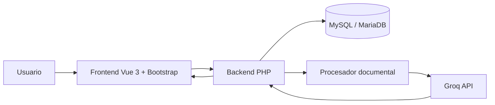
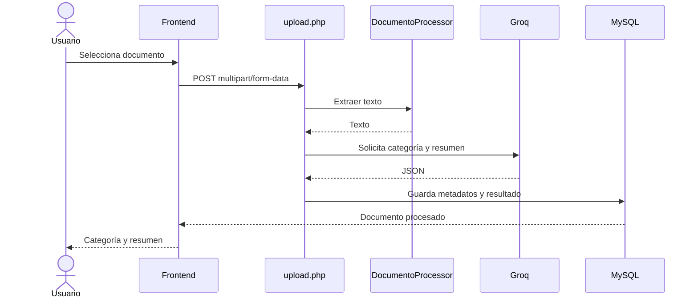
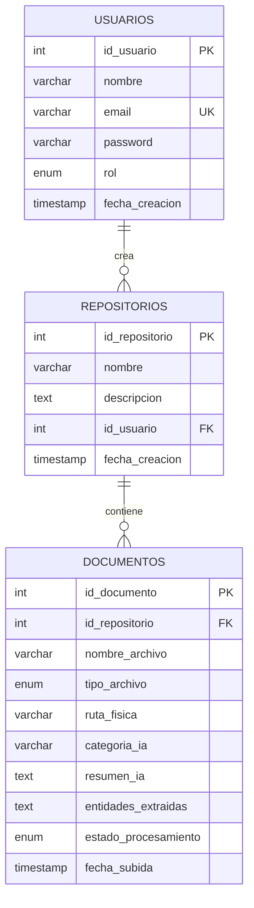

# 02 – Documento de Diseño
## 1. Arquitectura
DocMatrix AI utiliza una arquitectura web sencilla:

## 2. Capas
- **Frontend:** `frontend/index.html`, Vue 3, Bootstrap y Font Awesome.
- **Backend:** PHP, organizado en configuración y controladores.
- **Datos:** MySQL/MariaDB mediante PDO.
- **Procesamiento:** `DocumentoProcessor.php`.
- **IA:** `IaService.php`.
- **Consulta:** `search.php`.

## 3. Flujo de procesamiento

## 4. Modelo de datos

## 5. Componentes
- `login.php`: autenticación.
- `register.php`: registro.
- `upload.php`: recepción y procesamiento.
- `DocumentoProcessor.php`: extracción.
- `IaService.php`: clasificación y resumen.
- `get_documentos.php`: listado.
- `delete_documento.php`: eliminación.
- `search.php`: consulta IA.
- `conexion.php`: conexión a BD.

## 6. API
| Endpoint | Método | Función |
|---|---|---|
| login.php | POST | Iniciar sesión |
| register.php | POST | Registrar usuario |
| upload.php | POST | Subir/procesar archivo |
| get_documentos.php | GET | Listar documentos |
| delete_documento.php | POST | Eliminar documento |
| search.php | POST | Preguntar a la IA |

## 7. Diseño de seguridad
La contraseña se procesa con `password_hash` y se verifica con `password_verify`. Para el repositorio Git se deben usar variables de entorno para la API key de Groq y las credenciales de BD. No se deben publicar secretos.

## 8. Decisión de IA
La implementación existente usa una API compatible con OpenAI proporcionada por Groq. La clasificación devuelve una categoría y el resumen devuelve hasta tres oraciones. La búsqueda actual construye un contexto con nombres, categorías y resúmenes de los documentos almacenados. Esto debe describirse como la implementación actual y no como un RAG vectorial completo.

## 9. Interfaces
La interfaz entregada contiene:
- inicio de sesión;
- registro;
- listado de documentos;
- carga de archivos;
- visualización de resumen;
- eliminación;
- campo para consultas a la IA.
